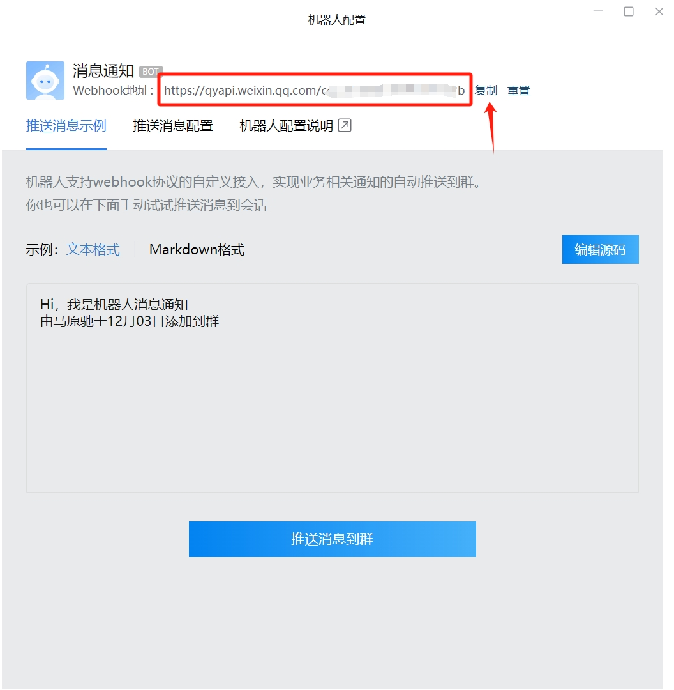

[](https://badge.fury.io/py/tdxtrader)
[](https://pepy.tech/project/tdxtrader)

# tdxtrader

通达信预警信号程序化交易

> 声明：本项目仅用于学习和研究，不保证交易收益，不作为投资建议，风险自负，请充分使用QMT模拟盘测试。

## 欢迎加入知识星球


## 运行效果


## 安装

```shell
pip install tdxtrader
```

## 预警指标设置

设置两个指标，一个作为买入信号，一个作为卖出信号


## 预警文件设置


## demo

### 基础示例

```python
import tdxtrader
# 参数
account_id = 'xxxx' # 账号ID
mini_qmt_path = r'D:\国金证券QMT交易端\userdata_mini' # mini_qmt 路径
file_path = r'D:\new_tdx\sign.txt' # 预警文件路径
interval = 1 # 轮询时间(秒)
buy_sign = 'KDJ买入条件选股' # 买入信号
sell_sign = 'KDJ卖出条件选股' # 卖出信号

def buy_event(params):
    '''买入事件'''

    stock = params.get('stock')

    return { 
        'size': 200, 
        'price': -1, # 如果是限价，则设置价格
        'type': '市价', # 市价，限价
    }

def sell_event(params):
    '''卖出事件'''

    stock = params.get('stock')
    position = params.get('position')
    
    return { 
        'size': position.can_use_volume, # 卖全仓
        'price': -1,  # 如果是限价，则设置价格
        'type': '市价' # 市价，限价
    }


tdxtrader.start(
    account_id=account_id,
    mini_qmt_path=mini_qmt_path,
    file_path=file_path,
    interval=interval,
    buy_sign=buy_sign,
    sell_sign=sell_sign,
    buy_event=buy_event,
    sell_event=sell_event,
    cancel_after=10 # 10秒未成交则撤单
)
```

### 限价委托（获取预警价格）

stock对象中包含了当前股票的详细信息，可以通过price属性获取预警时的价格

```python
def buy_event(params):
    '''买入事件'''

    stock = params.get('stock')

    return { 
        'size': 200, 
        'price': stock.get('price'), # 如果是市价，则设置-1
        'type': '限价', # 市价，限价
    }

def sell_event(params):
    '''卖出事件'''

    stock = params.get('stock')
    position = params.get('position')

    return { 
        'size': position.can_use_volume, # 卖全仓
        'price': stock.get('price'),  # 如果是市价，则设置-1
        'type': '限价' # 市价，限价
    }
```

### 按金额买卖

```python
def buy_event(params):
    '''买入事件'''

    stock = params.get('stock')

    return { 
        'amount': 100000, 
        'price': stock.get('price'), # 如果是市价，则设置-1
        'type': '限价', # 市价，限价
    }

def sell_event(params):
    '''卖出事件'''

    stock = params.get('stock')

    return { 
        'amount': 100000, # 卖全仓
        'price': stock.get('price'),  # 如果是市价，则设置-1
        'type': '限价' # 市价，限价
    }
```

### 使用当前持仓判断是否买入

```python
def buy_event(params):
    '''买入数量'''

    stock = params.get('stock')
    position = params.get('position')

    if position is None:
        return { 
            'amount': 100000, 
            'price': stock.get('price'), # 如果是市价，则设置-1
            'type': '限价', # 市价，限价
        }
    else:
        return None

def sell_event(params):
    '''卖出数量'''

    stock = params.get('stock')

    return { 
        'amount': 100000, # 卖全仓
        'price': stock.get('price'),  # 如果是限价，则设置价格
        'type': '限价' # 市价，限价
    }
```

### 按资金比例买入（卖出逻辑一致）

```python
def buy_event(params):
    '''买入数量'''

    stock = params.get('stock')
    position = params.get('position')
    xt_trader = params.get('xt_trader')
    account = params.get('account')

    asset = xt_trader.query_stock_asset(account)

    if position is None:
        return { 
            'amount': asset.total_asset * 0.01, 
            'price': stock.get('price'), # 如果是市价，则设置-1
            'type': '限价', # 市价，限价
        }
    else:
        return None
```

### 多买入/卖出信号示例

```python
import tdxtrader
# 参数
account_id = 'xxxx' # 账号ID
mini_qmt_path = r'D:\国金证券QMT交易端\userdata_mini' # mini_qmt 路径
file_path = r'D:\new_tdx\sign.txt' # 预警文件路径
interval = 1 # 轮询时间(秒)
buy_sign = ['KDJ买入条件选股', 'MACD买入条件选股'] # 多个买入信号
sell_sign = ['KDJ卖出条件选股', 'MACD卖出条件选股'] # 多个卖出信号

def buy_event(params):
    '''买入事件'''

    stock = params.get('stock')

    return { 
        'size': 200, 
        'price': -1, # 如果是限价，则设置价格
        'type': '市价', # 市价，限价
    }

def sell_event(params):
    '''卖出事件'''

    stock = params.get('stock')
    position = params.get('position')
    
    return { 
        'size': position.can_use_volume, # 卖全仓
        'price': -1,  # 如果是限价，则设置价格
        'type': '市价' # 市价，限价
    }


tdxtrader.start(
    account_id=account_id,
    mini_qmt_path=mini_qmt_path,
    file_path=file_path,
    interval=interval,
    buy_sign=buy_sign,
    sell_sign=sell_sign,
    buy_event=buy_event,
    sell_event=sell_event,
    cancel_after=10 # 10秒未成交则撤单
)
```

### 企业微信通知

利用企业微信机器人发送通知

设置群机器人参看：https://open.work.weixin.qq.com/help2/pc/14931

```python
tdxtrader.start(
    account_id=account_id,
    mini_qmt_path=mini_qmt_path,
    file_path=file_path,
    interval=interval,
    buy_sign=buy_sign,
    sell_sign=sell_sign,
    buy_event=buy_event,
    sell_event=sell_event,
    cancel_after=10, # 10秒未成交则撤单,
    wechat_webhook_url='你的webhook_url' # 企业微信机器人webhook url
)
```




## 详细参数

### account_id

QMT账号ID

### mini_qmt_path

QMT mini路径

### file_path

预警文件路径

### interval

轮询时间(秒)

### buy_sign

买入信号

### sell_sign

卖出信号

### buy_event

买入事件

### sell_event

卖出事件

### cancel_after

未成交撤单时间(秒)

### wechat_webhook_url

企业微信机器人webhook url
